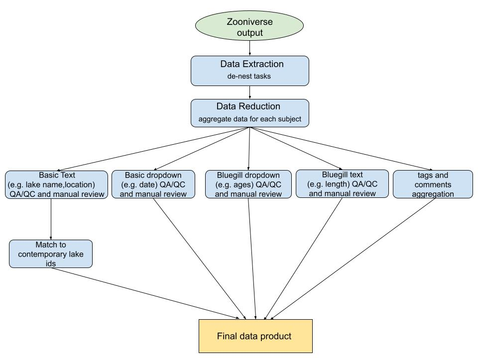
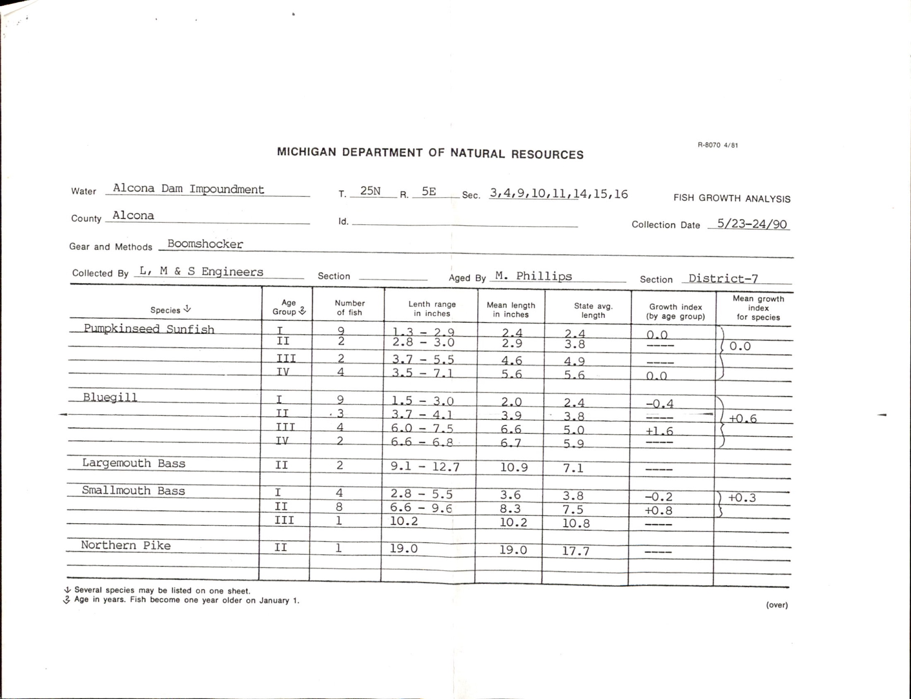

**Description:** This tutorial describes the process of cleaning, aggregating, and standardizing output from Zooniverse transcribed data. The initial data extraction and reduction process from Zooniverse JSON data output was first run in Python using the panoptes-aggregation package, a package specifically made for Zooniverse projects, and is not included in this tutorial (Figure 1). The resulting csv files from this process come from two Zooniverse workflows 1) Basic tasks - where volunteers transcribe geographic location, dates of sampling, and collectors which are fields common to all data card types and 2) Growth tasks - where volunteers transcribe the number of fish, range and mean length of the fish, and fish age from growth cards. We combine several types of tasks from each of these workflows to produce a complete set of bluegill data from growth cards (Figure 1).  

We first clean each of these tasks separately, then aggregate the datasets, and join them with the comments from the volunteer transcribers and the lake names that were matched to a local authority file (Figure 1). Finally, we standardize and quality check units.



---
# Part 1: Load libraries and data  
We have several datasets to load that will help us clean and match the output from Zooniverse. All data sets and code for this tutorial can be downloaded from github, https://github.com/CHANGES-UM/data_curation_examples.

1) “grow_card_lake_match_13Sep2021.csv” is a file that links historical lakes to the current “new_key”, a lake identifier given to each lake by the Michigan Department of Natural Resources. 

2) “basic_GROW_URLs.csv” is a file that has all of the links to the data card images. Take a look at an example image of a data card to become familiar with the original data format. 


3) “Basic_task_value.csv” and “GROW_task_values.csv” are files that have the task code from Zooniverse that can be linked to the actual task name 

4) “Basic_date_values.csv” and “GROW_age_values” are files that have codes from Zooniverse drop down options that link to the actual date or the actual age value.


```{r message=FALSE, warning=FALSE}
#### load libraries #### 
library(dplyr) # library for data munging 
library(tidyr) # library for data munging 
library(stringr) #library for regex functions 
library(rqdatatable) #join and replace NAs from one table with data from another 

#### load data #### 
#read in lake match data where lakes were matched to MDNR authority file   
lake_match <-read.csv("blg_grow_data/lake_match.csv", header=TRUE, na.strings = c("", "NA")) %>%
  select(subject_id, county, lakename, 'new.key') %>%
  rename(new_key = 'new.key') %>%
  drop_na('new_key')

#read in urls for card images 
urls<-read.csv("blg_grow_data/basic_GROW_URLs.csv", na.strings = c("", "NA"))  %>% 
  distinct(subject_id, .keep_all = TRUE) 

#read in basic task names
basic_task_values<-read.csv("blg_grow_data/basic_task_value.csv", header=TRUE) %>%
  select(task, column_name)

#read in grow task names 
grow_task_values<-read.csv("blg_grow_data/GROW_task_values.csv", header=TRUE)

#read in dropdown values 
basic_date_values<-read.csv("blg_grow_data/basic_date_values.csv", header=TRUE)

grow_age_values<-read.csv("blg_grow_data/GROW_age_values.csv", header=TRUE) %>% 
  mutate(code= as.factor(code))


```

# Part 2: Clean basic text data 

First, let’s look at how we clean basic text data, in this case sampling dates. On our data cards, begin and end dates were reported for sampling periods. We read in data for the sampling dates that were transcribed in Zooniverse. Each task was answered by 4 or more volunteers, so in order to separate the answers from each of the volunteers into separate columns, we remove punctuation, add an _ in place of spaces, and then separate the answers and number of reviews. We also join to the tasks and date code tables so that we get the actual names of tasks and the dates.

```{r message=FALSE, warning=FALSE}
#basic_dropdown (dates) cleaning # 

basic_dropdown<-read.csv("blg_grow_data/basic_GROW_dropdowns.csv", na.strings = c("", "NA")) %>%
  select(subject_id, task, 'data.value') %>%
  drop_na('data.value') %>% 
  rename(data_value = 'data.value') %>% 
  mutate(sep = gsub("[[:punct:]]", "", data_value), #remove punctuation 
        sep = gsub("\\s", "_", sep),  #replace space with _
        ) %>% 
  separate(col=sep, c("date_hash", "review", "date_hash2", "review2", "date_hash3", "review3", "date_hash4", "review4" ), sep = "_") %>%
                left_join(basic_task_values) %>% #get actual column name 
                  left_join(basic_date_values, by=c('date_hash' = 'code')) %>% 
                    left_join(basic_date_values, by=c('date_hash2' = 'code'))  %>% 
                      left_join(basic_date_values, by=c('date_hash3' = 'code')) %>% 
                        left_join(basic_date_values, by=c('date_hash4' = 'code')) %>% 
                        rename(date1=month.x, date2=month.y, date3=month.x.x, date4=month.y.y) %>%
                          mutate(date1 = ifelse(is.na(date1), date_hash, date1), #if date is NA then replace with the day/year, else keep month 
                                 date2 = ifelse(is.na(date2), date_hash2, date2),
                                 date3 = ifelse(is.na(date3), date_hash3, date3),
                                 date4 = ifelse(is.na(date4), date_hash4, date4)
                          )
```

Next, we keep answers that have consensus (>50%) and those without consensus are reviewed manually (about 4% of observations). You can review the data that did not have consensus as the first "dates_still_na" output below and compare it with the corresponding image found at the URL in the url_front column. This output was saved as a .csv and the research team corrected data in a spreadsheet. This .csv file of manually reviewed data by the research team is read in (and will override the original "dates_still_na" output) and joined with the consensus data. 
Because volunteers had the option to either put in the actual end date or choose "same as the begin date", we replace the "same as" answers with the actual date. We also pivot the table to wide format so that each subject (card) is a row and each task becomes its own column. 

```{r message=FALSE, warning=FALSE}
#filter out observations where the review is split 50:50 or less
#but if there is a split because choosing 'same as' then don't need to review these 
#observations for manual review (n=1027 of 24809)
dates_still_na<-filter(basic_dropdown, review < 3 & (!is.na(review2) | review2 < 3)) %>%
  select(-c(task, data_value, date_hash, date_hash2, date_hash3, date_hash4)) %>%
  mutate(date= case_when( 
    (date2 == 'Same as Begin Date (Month)' | date2 == 'Same as Begin Date (Day)' | date2 == 'Same as Begin Date (Year)') & is.na(date3)   ~ date1, # if ~ then 
    (date1 == 'Same as Begin Date (Month)' | date1 == 'Same as Begin Date (Day)' | date1 == 'Same as Begin Date (Year)') & is.na(date3)   ~ date2)
  )  %>% 
   filter(is.na(date))  %>% 
                 left_join(urls )


sameas_dates<-filter(basic_dropdown, review < 3 & (!is.na(review2) | review2 < 3)) %>%
  select(-c(task, data_value, date_hash, date_hash2, date_hash3, date_hash4)) %>%
  mutate(date= case_when( 
    (date2 == 'Same as Begin Date (Month)' | date2 == 'Same as Begin Date (Day)' | date2 == 'Same as Begin Date (Year)') & is.na(date3)   ~ date1, # if ~ then 
    (date1 == 'Same as Begin Date (Month)' | date1 == 'Same as Begin Date (Day)' | date1 == 'Same as Begin Date (Year)') & is.na(date3)   ~ date2)
  )  %>% 
   filter(!is.na(date))  %>% pivot_wider(
                id_cols = c(subject_id),
                    names_from = column_name, 
                     values_from = c(date), 
                     values_fill = list(date = NA) )

# keep reviews of 3 or greater as the answer  
dates_good<-filter(basic_dropdown, review >= 3 | is.na(review2) | review2 >= 3) %>%
  mutate(date= case_when(
    is.na(review2) ~ date1, # if ~ then 
    review2 > review ~ date2, 
    review > review2 ~ date1 
  )) %>%
  select(subject_id, column_name, date) %>% 
  pivot_wider(id_cols = c(subject_id),
              names_from = column_name, 
              values_from = c(date), 
              values_fill = list(date = NA) ) %>%
  natural_join(sameas_dates, by  = 'subject_id', jointype = "FULL") %>% 
  mutate(end_date_day = ifelse(end_date_day =='Same as Begin Date (Day)', begin_date_day, end_date_day),
         end_date_month =ifelse(end_date_month =='Same as Begin Date (Month)', begin_date_month, end_date_month),
         end_date_year = ifelse(end_date_year =='Same as Begin Date (Year)', begin_date_year, end_date_year) 
          )

#merging back in manually reviewed data 
dates_still_na<-read.csv("blg_grow_data/dates_manual.csv", na.strings = c("", "NA")) %>%
  select(subject_id, column_name, date) %>% 
  pivot_wider(id_cols = c(subject_id),
                names_from = column_name, 
                values_from = c(date), 
                values_fill = list(date = NA) )

dates_clean_plus_manual<-natural_join(dates_good, dates_still_na, by  = 'subject_id', jointype = "FULL")


```

Finally, a quality check is done to see if begin and end years are the same. If not, these are also reviewed manually by someone from the research team. 
The manually reviewed data by the research team is read in and joined with the consensus data.  

```{r message=FALSE, warning=FALSE}

#QA/QC:check begin and end years that don't match n=351 of 4682  - review manually 
dates_clean_plus_manual<-dates_clean_plus_manual %>% 
  mutate(review = ifelse(begin_date_year != end_date_year, "TRUE", "FALSE")
  )

grow_dates_review<-read.csv("blg_grow_data/year_manual.csv")%>% 
  select(-c("review"))

dates_final<-filter(dates_clean_plus_manual, review == 'FALSE' | is.na(review)) %>% 
                left_join(urls) %>% 
                drop_na('URL_front') %>% 
                select(-c("review")) %>%
                mutate (comment = NA)%>%
                rbind(grow_dates_review) %>% 
            rename(url_front= URL_front, url_back= URL_back)

```

# Part 3: Clean fish lengths text data 

Data for the the number of fish, fish length ranges, and fish length means are read in and joined to the task values. Data is then cleaned by removing text and units.

```{r message=FALSE, warning=FALSE}
#### blgrow_text (length info) cleaning ####
blgrow_text<-read.csv("blg_grow_data/bluegill_texts.csv") %>%
  select(subject_id, task, 'data.aligned_text', 'data.number_views', 'data.consensus_score','data.consensus_text') %>%
  drop_na('data.number_views') %>% 
  left_join(grow_task_values) %>% 
  mutate(data = str_remove(data.consensus_text, "//.*"), #remove string after // 
         data = ifelse(data =='3 six year old samples', 0, data), 
         data = gsub("mm" , '', data), #remove units
         data = gsub("cm" , '', data), 
         data = gsub("in" , '', data)
         ) %>% #remove one weird answer '3 six year old samples' should say 'no six year old samples' 
  naniar::replace_with_na(replace = list(data = c('-', '--', "---", '...', '. . .', "-----", "———"))) %>% #function that replaces all of a value with NA 
  drop_na('data') %>%
  separate(data, c("data", "trash"), sep = " ") %>%  #gets rid of extra stuff
    select(-c(trash))

```

Answers that have consensus (>50%) are kept and those without consensus were reviewed manually and are then joined back with the consensus data similarly to the basic data.
```{r message=FALSE, warning=FALSE}
#1230 
## what was recorded by only 1 person
blg_text_bad1<- filter(blgrow_text, data.number_views == 1) 
# what was viewed by >= 2 people but half did not agree 
blg_text_bad2<- filter(blgrow_text, (data.number_views >2 & data.consensus_score < 2)| (data.number_views ==2 & data.consensus_score < 2) ) 

#good data where consensus is >50% 
blg_text_good<-filter(blgrow_text, (data.number_views >2 & data.consensus_score > 2)| (data.number_views ==2 & data.consensus_score >= 2) ) %>%
select(subject_id, column_name, data)

#merging back in manually reviewed data 
manual_length1<-read.csv("blg_grow_data/manual_text1.csv", na.strings = c("", "NA")) %>%
  select(subject_id, column_name, data) %>%
  mutate(column_name = gsub(" row", "_row", column_name))
manual_length2<-read.csv("blg_grow_data/manual_text2.csv", na.strings = c("", "NA")) %>%
  select(subject_id, column_name, data)%>%
  mutate(column_name = gsub(" row", "_row", column_name))

lengths_clean<-gtools::smartbind(blg_text_good, manual_length1, manual_length2) %>%
             pivot_wider( 
                               id_cols = c(subject_id),
                               names_from = column_name, 
                               values_from = c(data), 
                               values_fill = list(data = NA) )

```
# Part 4: Clean fish age dropdown tasks 

The Zooniverse data for fish ages from a dropdown task is read in and cleaned similarly to the date dropdown task. Dropdown tasks are advantageous in that they give volunteers a fixed vocabulary and are therefore less prone to typos or inconsistent formatting. Punctuation is removed, the volunteers’ answers are moved into separate columns, the hash values are replaced with reported ages, and then joined with the task values.

```{r message=FALSE, warning=FALSE}
#read in file 
blgrow_dropdown<-read.csv("blg_grow_data/bluegill_dropdowns.csv", na.strings = c("", "NA")) %>%
  select(subject_id, task, 'data.value') %>%
  drop_na('data.value') %>% 
  rename(data_value = 'data.value') %>% 
  mutate(sep = gsub("[[:punct:]]", "", data_value), 
         sep = gsub("\\s", "_", sep)
  ) %>% 
  separate(col=sep, c("age_hash", "review", "age_hash2", "review2", "age_hash3", "review3", "age_hash4", "review4" ), sep = "_") %>% 
  mutate(age_hash= as.factor(age_hash),
          age_hash2=as.factor(age_hash2),
          age_hash3=as.factor(age_hash3),
          age_hash4=as.factor(age_hash4) ) %>% 
  left_join(grow_task_values) %>% 
  left_join(grow_age_values, by=c('age_hash' = 'code')) %>% 
  left_join(grow_age_values, by=c('age_hash2' = 'code'))  %>% 
  left_join(grow_age_values, by=c('age_hash3' = 'code')) %>% 
  left_join(grow_age_values, by=c('age_hash4' = 'code')) %>% 
  rename(age1=age_group.x, age2=age_group.y, age3=age_group.x.x, age4=age_group.y.y) %>% 
  mutate(age1 = ifelse(age_hash =='9f71969064233', 5, age1), 
         age2 = ifelse(age_hash =='9f71969064233', 5, age2),
         age3 = ifelse(age_hash =='9f71969064233', 5, age3)) #for some reason this hash code did not match

```


Answers that have consensus (>50%) are kept and those without consensus are reviewed manually and then joined back with the consensus data. 

```{r message=FALSE, warning=FALSE}

# keep >= 3s OR any that were 2 but don't have disagreements (NAs) 
age_good<-filter(blgrow_dropdown, review >= 3 | review2 >= 3 | (review == 2 & is.na(review2)) ) %>%
  mutate(age= case_when(
    is.na(review2) ~ age1, # if ~ then (total agreement)
    review2 > review ~ age2, # if ~ then (majority selected)
    review > review2 ~ age1 # if ~ then (majority selected)
  )) %>%
  select(subject_id, column_name, age)

#filter out the ones for manual review (n=429 of 12201)
age_manual<-filter(blgrow_dropdown, review < 3  & review2 < 3 | (review == 1 & is.na(review2))) %>%
  select(-c(task, data_value, age_hash, age_hash2, age_hash3, age_hash4))

age_manual<-read.csv( "blg_grow_data/ages_manual.csv") %>% #after manual review 
            select(subject_id, column_name, age)%>%
  mutate(column_name = gsub(" row", "_row", column_name))

#join manually reviewed and good datasets 
age_data<-rbind(age_good, age_manual)%>%
  pivot_wider(id_cols = c(subject_id),
               names_from = column_name, 
               values_from = c(age), 
               values_fill = list(age = NA) )
```

# Part 5: Joining age and length data 
The age data are joined with the length data then we pivot the table so that we have a long table with a column for age group, fish count, length range, and length mean. We rename the columns and then remove rows that do not have data. We then split out the length range into min and max values. We also checked instances where the age group was listed as NA by looking at the original card to determine if this data was actually missing or were errors, these rows were removed due to errors in transcription. 

```{r message=FALSE, warning=FALSE}

#join age data: dropdown ages and length text  ####
all_grow<-left_join(age_data, lengths_clean) %>% 
   pivot_longer(-subject_id,
               names_to =c("row", ".value"),
                names_sep ="_row") %>% 
    rename(age_group = " age group ", fish_count = " Number of Fish ", length_range = " Length Range ", length_mean = " Mean Length ") %>% 
      filter(if_any(c("age_group", "fish_count", "length_range", "length_mean"), complete.cases)) %>%
  separate(length_range, c("length_min", "length_max"), sep = "-") %>% 
mutate(fish_count = as.numeric(as.character(fish_count)), 
      length_min = as.numeric(as.character(length_min)), 
      length_max = as.numeric(as.character(length_max)),
      length_mean = as.numeric(as.character(length_mean))
                                         )%>% 
  select(-c(row)) %>% 
  drop_na('age_group') #drop rows where age group is NA 

```

# Part 6: Combine all data and perform quality control 

The final steps are combining all data and standardizing units. We read in and aggregate comments from volunteer transcribers. Volunteers could leave comments for individual images that they were classifying. These comments may mention units, interesting discoveries, or anomalies on the cards. These comments were helpful in discovering units and may include other information that researchers find useful when using the data. 
Original data were mostly recorded in inches, however, some cards specify when they were instead recorded in centimeters or millimeters, so we made a file that has these cases.
We join the grow card information with the basic dates, the lake matches, the units, and comments.  
We standardize all units by converting all lengths to millimeters. 
A quality check is done to plot these data to look for outliers. 
A quality check is also done to ensure where the fish count is 0 there are no length data. 

```{r message=FALSE, warning=FALSE}
#### clean up comments and join all data #### 
#read in comments 
blgrow_comments<-read.csv("blg_grow_data/blg_comments.csv") %>%
  select(subject_id, "X_...comment_body") %>%
  rename(comments = "X_...comment_body")

comments <- aggregate(blgrow_comments[2], blgrow_comments[-2], 
                      FUN = function(X) paste(unique(X), collapse=", "))

grow_units<-read.csv("blg_grow_data/grow_card_units.csv")  

GROW<-left_join(all_grow, dates_final) %>%
  left_join(lake_match) %>%
  left_join(grow_units) %>% #units from manual review and tags
  left_join(comments) %>%
  drop_na('url_front') %>% #drop cards without a url, these were removed from workflows 
  mutate(units= case_when(
    unit == "centimeters" ~ "centimeters",
    unit == "millimeters" ~ "millimeters",
    TRUE ~ 'inches'   )) %>%
  mutate(length_min_mm = case_when( #convert everything to millimeters 
    units == 'inches' ~ length_min*25.4, 
    units == 'centimeters' ~ length_min*10, 
    TRUE ~ length_min # else keep as mm 
  )) %>%
  mutate(length_max_mm = case_when(
    units == 'inches' ~ length_max*25.4, 
    units == 'centimeters' ~ length_max*10, 
    TRUE ~ length_max # else keep as mm 
  ))  %>%
  mutate(length_mean_mm = case_when(
    units == 'inches' ~ length_mean*25.4, 
    units == 'centimeters' ~ length_mean*10, 
    TRUE ~ length_mean # else keep as mm 
  )) %>%
  select(-c(length_min, length_max, length_mean, units, unit)) %>% 
  mutate(length_mean_mm = ifelse(is.na(length_mean_mm) & fish_count == 1, length_min_mm, length_mean_mm)) %>% 
  mutate(length_min_mm = ifelse(subject_id =='58642811' & age_group == 7, 180.34, length_min_mm) ) #one outlier that looks like a typo based on max and mean values 

#QAQC check for outliers 
plot(GROW$length_max_mm) 
plot(GROW$length_min_mm)
plot(GROW$length_mean_mm) 
 
#add some comments for cards with multiple bluegill records for different gear types 
GROW<-GROW %>% 
  mutate(comments=ifelse(subject_id == "58642823", 'two gear types', comments), 
        comments=ifelse(subject_id == "58642824", 'two gear types', comments)
  )

#QAQC if the fish count is 0 and not NA then there should not be length values, these were checked 
GROW<-GROW%>% 
  mutate(length_min_mm = ifelse(fish_count == 0 & !is.na(fish_count), NA, length_min_mm),
         length_max_mm = ifelse(fish_count == 0 & !is.na(fish_count), NA,length_max_mm),
         length_mean_mm = ifelse(fish_count == 0 & !is.na(fish_count), NA, length_mean_mm)
) %>% 
  mutate(comment = ifelse(is.na(comment), comments, comment)
         ) %>% 
  select(-c(comments))

#reorder columns so that identifiers are at the beginning, followed by fish info, dates, and urls
GROW <- GROW[, c(1, 15,14,13, 2, 3, 16,17,18, 4,5,6, 7, 8,9,12, 10,11)]


```
